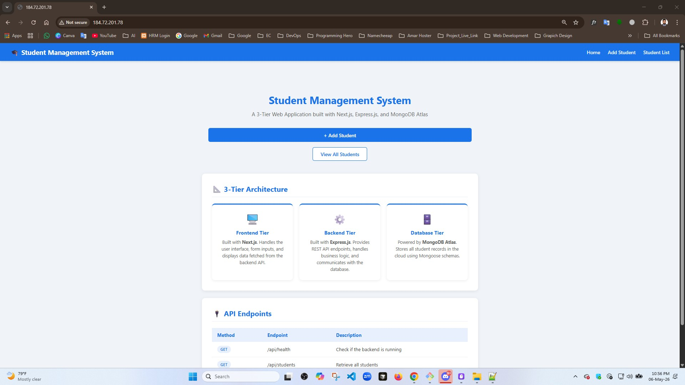
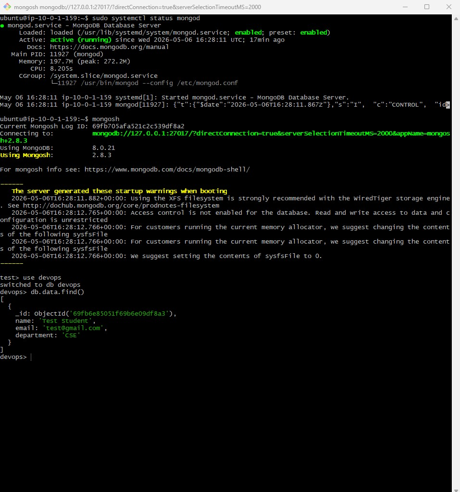

# Design and Deploy a 3-Tier Application Using EC2 Instances

## Project Title

3-Tier Student Management Application using Next.js, Express.js, MongoDB, Nginx,
PM2, and AWS EC2

---

# Project Overview

This project demonstrates a complete 3-tier application deployment on AWS EC2
instances.

The architecture consists of:

1. Presentation Layer (Frontend)
2. Application Layer (Backend API)
3. Data Layer (Database)

The application allows users to:

- Add students
- View student list
- Store data in MongoDB database

Technologies used:

- Next.js
- Express.js
- MongoDB
- Nginx
- PM2
- AWS EC2
- Ubuntu 24.04

---

# 3-Tier Architecture

## 1. Presentation Layer

Purpose:

- User interface
- Handles frontend rendering
- Sends API requests to backend

Technology:

- Next.js
- Nginx

EC2 Instance:

- Web Server

Public Access:

- Port 80
- Port 443

---

## 2. Application Layer

Purpose:

- Handles business logic
- Processes API requests
- Communicates with database layer

Technology:

- Node.js
- Express.js
- PM2

EC2 Instance:

- App Server

Port:

- 5000

---

## 3. Data Layer

Purpose:

- Stores application data
- Provides database services

Technology:

- MongoDB Community Server

EC2 Instance:

- Database Server

Port:

- 27017

---

# EC2 Instance Information

## Web Server (Presentation Layer)

- Public IP: 184.72.201.78
- Private IP: 10.0.1.89
- Purpose: Frontend + Nginx

---

## App Server (Application Layer)

- Private IP: 10.0.11.180
- Purpose: Express.js Backend API

---

## Database Server (Data Layer)

- Private IP: 10.0.1.159
- Purpose: MongoDB Database

---

# Security Group Configuration

## Web Server Security Group

Inbound Rules:

| Port | Protocol | Source    |
| ---- | -------- | --------- |
| 22   | TCP      | My IP     |
| 80   | TCP      | 0.0.0.0/0 |
| 443  | TCP      | 0.0.0.0/0 |

---

## App Server Security Group

Inbound Rules:

| Port | Protocol | Source        |
| ---- | -------- | ------------- |
| 22   | TCP      | Web Server SG |
| 5000 | TCP      | Web Server SG |

---

## Database Server Security Group

Inbound Rules:

| Port  | Protocol | Source        |
| ----- | -------- | ------------- |
| 22    | TCP      | App Server SG |
| 27017 | TCP      | App Server SG |

---

# Project Structure

```bash
project/
│
├── frontend/
│   ├── app/
│   ├── public/
│   ├── package.json
│   └── .env.local
│
├── backend/
│   ├── config/
│   ├── controllers/
│   ├── models/
│   ├── routes/
│   ├── server.js
│   ├── package.json
│   └── .env
│
└── README.md
```

---

# Setup Steps

# Step 1: Launch EC2 Instances

Create minimum 3 EC2 instances:

1. Web Server
2. App Server
3. Database Server

OS:

- Ubuntu 24.04

Instance Type:

- t3.medium

---

# Step 2: Connect to EC2

```bash
ssh -i Aulad-Key.pem ubuntu@PUBLIC_IP
```

---

# Web Server Setup

## Update System

```bash
sudo apt update && sudo apt upgrade -y
```

---

## Install Node.js

```bash
curl -fsSL https://deb.nodesource.com/setup_20.x | sudo -E bash -
sudo apt install nodejs -y
```

Check:

```bash
node -v
npm -v
```

---

## Install Nginx

```bash
sudo apt install nginx -y
```

Start:

```bash
sudo systemctl enable nginx
sudo systemctl start nginx
```

Check:

```bash
sudo systemctl status nginx
```

---

## Install PM2

```bash
sudo npm install -g pm2
```

---

## Clone Frontend Project

```bash
git clone YOUR_GITHUB_REPOSITORY_LINK
```

```bash
cd project/frontend
```

---

## Install Frontend Dependencies

```bash
npm install
```

---

## Configure Frontend Environment

```bash
nano .env.local
```

```env
NEXT_PUBLIC_API_URL=http://10.0.11.180:5000
```

---

## Build Frontend

```bash
npm run build
```

---

## Run Frontend Using PM2

```bash
pm2 start npm --name frontend -- start
```

```bash
pm2 save
```

---

## Configure Nginx

```bash
sudo nano /etc/nginx/sites-available/frontend
```

Paste:

```nginx
server {
    listen 80;
    server_name 184.72.201.78;

    location / {
        proxy_pass http://localhost:3000;
        proxy_http_version 1.1;

        proxy_set_header Upgrade $http_upgrade;
        proxy_set_header Connection 'upgrade';
        proxy_set_header Host $host;

        proxy_cache_bypass $http_upgrade;
    }
}
```

Enable configuration:

```bash
sudo ln -s /etc/nginx/sites-available/frontend /etc/nginx/sites-enabled/
```

Test:

```bash
sudo nginx -t
```

Restart:

```bash
sudo systemctl restart nginx
```

---

# Application Layer Setup

## Connect to App Server

```bash
ssh -i Aulad-Key.pem ubuntu@10.0.11.180
```

---

## Install Node.js

```bash
curl -fsSL https://deb.nodesource.com/setup_20.x | sudo -E bash -
sudo apt install nodejs -y
```

---

## Install PM2

```bash
sudo npm install -g pm2
```

---

## Clone Backend Project

```bash
git clone YOUR_GITHUB_REPOSITORY_LINK
```

```bash
cd project/backend
```

---

## Install Dependencies

```bash
npm install
```

---

## Configure Backend Environment

```bash
nano .env
```

```env
PORT=5000
MONGO_URI=mongodb://10.0.1.159:27017/devops
DB_NAME=devops
COLLECTION_NAME=data
```

---

## Start Backend

```bash
npm start
```

OR

```bash
node server.js
```

Expected:

```text
MongoDB Connected
Server running on port 5000
```

---

## Run Backend Using PM2

```bash
pm2 start server.js --name backend
```

Check:

```bash
pm2 status
```

Logs:

```bash
pm2 logs backend
```

---

## API Testing

```bash
curl http://localhost:5000/api/health
```

```bash
curl http://localhost:5000/api/students
```

---

# Database Layer Setup

## Connect to Database Server

```bash
ssh -i Aulad-Key.pem ubuntu@10.0.1.159
```

---

## Install MongoDB

```bash
sudo apt install -y gnupg curl
```

```bash
curl -fsSL https://www.mongodb.org/static/pgp/server-8.0.asc | \
sudo gpg -o /usr/share/keyrings/mongodb-server-8.0.gpg --dearmor
```

```bash
echo "deb [ arch=amd64,arm64 signed-by=/usr/share/keyrings/mongodb-server-8.0.gpg ] https://repo.mongodb.org/apt/ubuntu noble/mongodb-org/8.0 multiverse" | \
sudo tee /etc/apt/sources.list.d/mongodb-org-8.0.list
```

```bash
sudo apt update
```

```bash
sudo apt install -y mongodb-org
```

---

## Start MongoDB

```bash
sudo systemctl start mongod
```

```bash
sudo systemctl enable mongod
```

Check:

```bash
sudo systemctl status mongod
```

---

## Configure MongoDB Network

```bash
sudo nano /etc/mongod.conf
```

```yaml
net:
  port: 27017
  bindIp: 127.0.0.1,10.0.1.159
```

Restart:

```bash
sudo systemctl restart mongod
```

---

## Test MongoDB

```bash
mongosh
```

```js
use devops
```

```js
db.data.insertOne({
  name: 'Test Student',
  email: 'test@gmail.com',
  department: 'CSE',
});
```

```js
db.data.find();
```

---

# Connectivity Between Layers

## Web Server → App Server

```bash
curl http://10.0.11.180:5000/api/health
```

Expected:

```json
{ "status": "ok" }
```

---

## App Server → Database Server

Expected Backend Logs:

```text
MongoDB Connected
```

---

# Application Access Result

## Frontend URL

```text
http://184.72.201.78
```

---

## Backend API

```text
http://10.0.11.180:5000/api/health
```

---

# PM2 Commands

## Status

```bash
pm2 status
```

## Logs

```bash
pm2 logs
```

## Restart

```bash
pm2 restart all
```

## Stop

```bash
pm2 stop all
```

---

# Screenshots (Proof of Work)

Include screenshots of:

1. AWS EC2 Instances
2. Security Groups
3. Nginx Running
4. PM2 Status
5. MongoDB Running
6. Frontend Running in Browser
7. API Test Result
8. MongoDB Data Inserted
9. MongoDB Data Retrieved
10. Web Server → App Server Connectivity
11. App Server → Database Server Connectivity

---

# Marking Scheme Coverage

| Criteria                             | Status    |
| ------------------------------------ | --------- |
| Architecture Setup                   | Completed |
| Nginx Configuration                  | Completed |
| Backend Application                  | Completed |
| Database Setup                       | Completed |
| Connectivity Between Layers          | Completed |
| Documentation (README + Screenshots) | Completed |

---

# Final Result

Successfully designed and deployed a complete 3-tier application using:

- AWS EC2
- Next.js
- Express.js
- MongoDB
- Nginx
- PM2

The project maintains proper separation between:

- Presentation Layer
- Application Layer
- Data Layer

and satisfies all assignment constraints.

---

# 🔗 Git Repository Link

GITHUB_REPOSITORY_LINK:https://github.com/auladwd/3-tier-application






